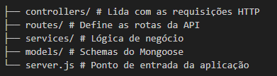

# 💰 Financial API

API REST construída com **Node.js**, **Express** e **MongoDB** para controle financeiro pessoal. Permite cadastrar, parcelar, listar, atualizar e excluir despesas, com controle de pagamento.

## 📦 Recursos

- ✅ Cadastro de despesas únicas ou parceladas
- 📅 Geração automática de parcelas mensais
- 🧾 Consulta de despesas por mês
- ✏️ Atualização de despesas (incluindo marcação como paga)
- ❌ Exclusão de despesas (com ou sem parcelas)
- 📊 Estrutura preparada para expansão com categorias, filtros e dashboard

## 🚀 Tecnologias

- Node.js
- Express
- MongoDB + Mongoose
- JavaScript

## 📁 Estrutura do Projeto

## 📖 Documentação Swagger

A documentação da API está disponível via Swagger UI:

- 📎 **URL:** [`http://localhost:3000/api-docs`](http://localhost:3000/api-docs)

> O Swagger é carregado automaticamente a partir do arquivo `swagger.yaml` localizado na raiz do projeto.

## ▶️ Execução
node server.js

## 🧑‍💻 Autor
Desenvolvido por Tamiriam Fernandes.